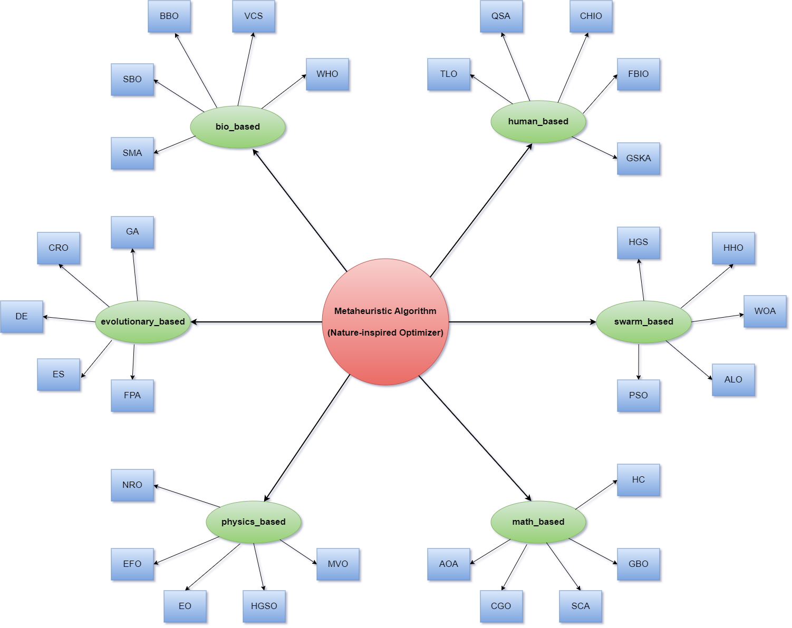

# Algorithm Categories

clypto organizes its catalog into ten taxonomy groups, following the
classification used by the original MEALPY project and the survey
[Lee & Kim (2020)](https://doi.org/10.1016/j.procs.2020.09.075).

| Category | Inspiration | Examples |
| --- | --- | --- |
| [Evolutionary-based](evolutionary_based.md) | Darwinian natural selection and evolutionary computing | GA, DE, SHADE, ES, FPA |
| [Swarm-based](swarm_based.md) | Collective movement and interaction of swarms | PSO, GWO, WOA, ABC, HHO |
| [Physics-based](physics_based.md) | Physical laws and phenomena | MVO, SA, EO, HGSO, RIME |
| [Human-based](human_based.md) | Human interactions and behavior | CA, ICA, QSA, TOA, HBO |
| [Bio-based](bio_based.md) | Biological creatures and microorganisms | BBO, IWO, SOS, SMA, TSA |
| [System-based](system_based.md) | Ecological, immune, and network systems | AEO, GCO, WCA |
| [Math-based](math_based.md) | Mathematical forms and laws | SCA, AOA, CEM, RUN, HC |
| [Music-based](music_based.md) | Musical instruments and compositions | HS |
| [Game-based](game_based.md) | Game-theoretic strategies | THRO |
| [SOTA-based](sota_based.md) | State-of-the-art CEC competition entrants | LSHADEcnEpSin, IMODE |

## How to read the catalog

Every category page is generated directly from the source tree. For each
optimizer module you get:

- a **summary table** of the module's classes, and
- per-class **hyper-parameters** and the **reference** to the original paper.

The naming convention is consistent across the catalog:

- `Original*` — the method as published.
- `Base*`, `Dev*`, `Improved*`, `Modified*`, `Enhanced*`, `Augmented*`,
  `Adaptive*` — developed or hybridized variants contributed by the community.

## Difficulty

The original project annotates algorithms by implementation difficulty, which is
useful when you are learning:

- **Easy** — few parameters, few equations, short source.
- **Medium** — more equations, longer source.
- **Hard** — many equations, long source, dense paper.
- **Hard\\*** — very hard; the paper is difficult to read.

Newcomers are encouraged to start with the easy and medium algorithms.

!!! warning "Before benchmarking"

    Several algorithms have known concerns — weaknesses, latent bugs, or
    suspected plagiarism. Always review [Known Issues](../issues.md) before
    using an algorithm in a comparative study.
